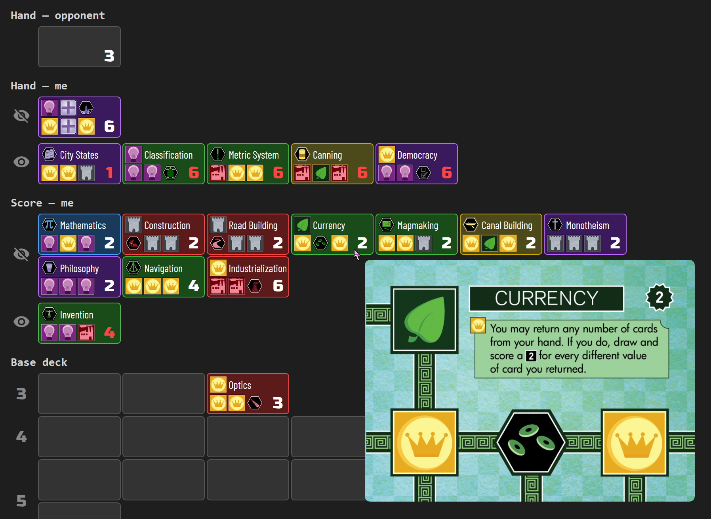

# BGA Tracker

Board games have a lot of information that is technically public but hard to track mentally. In turn-based games on [Board Game Arena](https://boardgamearena.com) this is even worse — hours or days pass between turns, and whatever you noticed earlier is long forgotten. Recovering it means scrolling through pages of game logs. This project does it for you and presents a brief, readable summary.

My initial focus is on 2p games of **Innovation** with Cities of Destiny expansion. No more struggling to remember:
- deck stack order after consecutive Alchemy or Physics calls, or returning cards after playing a city
- cards kept in the opponent's hand after melding a particular city
- cards revealed with Oars


> **Note:** Only tested on Windows. Scripts, paths, and commands all assume a Windows environment.

## How it works

1. A Playwright-controlled browser navigates to the BGA game page and fetches the full notification history via the BGA API
2. A JS script (running in the browser context) extracts card transfer events into a structured game log
3. A Python script replays every card movement from the log, tracking current locations, deck stack order, and which cards the opponent knows about
4. A formatter produces a colored HTML summary of the current game state from both perspectives

Player names are detected automatically from the game log. The `PLAYER_NAME` in `.env` determines which side is "me" vs "opponent".

## Setup

```
python -m venv venv
venv/Scripts/pip install -e .
venv/Scripts/pip install Pillow  # optional, for download_assets
venv/Scripts/playwright install chromium
```

Create a `.env` file in the project root:
```
PLAYER_NAME=YourBGAUsername

# Default section visibility (format_state.py)
# Deck sections: show / hide
DEFAULT_BASE_DECK=show
DEFAULT_CITIES_DECK=hide
# List sections: none / all / unknown
DEFAULT_BASE_LIST=none
DEFAULT_CITIES_LIST=none
# List layout: wide / tall
DEFAULT_BASE_LAYOUT=wide
DEFAULT_CITIES_LAYOUT=wide

# Section placement: column.position (e.g. 1.3 = column 1, 3rd section)
# All in column 1 by default; set column 2+ to create multi-column layout
SECTION_HAND_OPPONENT=1.1
SECTION_HAND_ME=1.2
SECTION_SCORE_OPPONENT=1.3
SECTION_SCORE_ME=1.4
SECTION_BASE_DECK=1.5
SECTION_CITIES_DECK=1.6
SECTION_BASE_LIST=1.7
SECTION_CITIES_LIST=1.8
```

Only `PLAYER_NAME` is required. All other settings are optional with sensible defaults.

Icon and card image assets are committed to the repo in `assets/`. To regenerate them from the upstream BGA sprite sheets (requires Pillow):
```
venv/Scripts/python -m bga_tracker.innovation.download_assets
```

## Usage

### 1. Start the browser helper

```
venv/Scripts/python -m browser.browse
```

This opens a persistent Chrome session. Commands are sent by writing to `scripts/cmd.txt`; results appear in `output/result.txt`.

### 2. Extract game log

Send these commands (one at a time, waiting for each result):
```
goto https://boardgamearena.com/<N>/innovation/innovation?table=TABLE_ID
eval scripts/fetch_full_history.js
eval scripts/innovation/extract_log.js
```

Save the final output to `data/<TABLE_ID>/game_log.json`.

### 3. Track card state

```
venv/Scripts/python -m bga_tracker.innovation.track_state TABLE_ID
```

Produces `game_state.json` — structured game state with card objects.

### 4. Format summary

```
venv/Scripts/python -m bga_tracker.innovation.format_state TABLE_ID
```

Produces `summary.html` — a colored HTML page showing deck contents, hands, and scores from both perspectives. Open it in a browser.

On first run, renames the data folder to include the opponent name (e.g. `809765534 jamdalla`). Subsequent runs find the renamed folder automatically.

## File structure

```
src/
  bga_tracker/
    __init__.py                 — exports PROJECT_ROOT
    innovation/
      card.py                   — Card class (candidate sets) + CardDB loader
      game_state.py             — GameState: locations, mutations, constraint propagation
      state_tracker.py          — StateTracker: log parsing, regex patterns → Actions
      track_state.py            — CLI entry point (delegates to StateTracker)
      format_state.py           — HTML summary formatter
      download_assets.py        — download BGA sprites + extract icons & card images
  browser/
    browse.py                   — Playwright-based browser helper
scripts/
  fetch_full_history.js         — BGA notification history fetch (generic, any game)
  innovation/
    extract_log.js              — notification parser (browser)
assets/                         — icon and card image assets
  icons/                        — extracted icon PNGs (resource, hex, bonus, cities special)
  cards/                        — full card face images (750x550, used for hover tooltips)
data/
  cardinfo.json                 — shared card database (sets 0 + 3, 210 cards)
  <TABLE_ID> <opponent>/        — per-game data
    game_log.json                — extracted game log (input)
    game_state.json              — structured game state (output)
    summary.html                 — colored HTML summary (output)
tests/
  innovation/
    test_regression.py          — regression tests for track_state + format_state
    test_opponent_knowledge.py  — unit tests for opponent knowledge model
    data/                       — committed fixture data (game logs + reference output)
pyproject.toml                  — package config (editable install)
.env                            — player name + display config (not committed)
```

## Testing

Regression tests replay the full pipeline on committed fixture data and compare output to reference files.

```
venv/Scripts/python -m pytest tests/ -v
```

Fixtures live in `tests/innovation/data/` — each subfolder contains a `game_log.json` (input) and the expected `game_state.json` + `summary.html` (reference output).

## Output format

### game_state.json

Structured game state with card objects. Card metadata (age, color, icons) is looked up from `cardinfo.json` by name — not duplicated in the output.

```json
{
  "actual_deck": {
    "1": {
      "base": [null, {"name": "Sailing", "revealed": false}],
      "cities": [null, null]
    }
  },
  "board": { "Player1": [{"name": "Clothing"}] },
  "hand":  { "Player1": [{"name": "Optics", "revealed": false}, {"age": 5, "set": 0}] },
  "score": { "Player1": [{"name": "The Wheel", "revealed": false}, {"age": 3, "set": 0}] },
  "achievements": [{"name": "Oars"}, null, null, null, null, null, null, null, null]
}
```

- **Resolved card** (hand/score): `{"name": "...", "revealed": false}` — `revealed` placeholder (always false for now)
- **Unresolved card** (hand/score): `{"age": int, "set": int}` — `0` = base, `3` = cities
- **Board card**: `{"name": "..."}` — always public
- **Deck entry**: `null` (unresolved) or `{"name": "...", "revealed": false}`
- **Achievement**: `{"name": "..."}` or `null` — age implied by index + 1
- `actual_deck`: ordered draw piles per (age, set). Index 0 = top. Only ages with cards remaining.

### download_assets.py

Downloads sprite sheets from the [bga-innovation](https://github.com/micahstairs/bga-innovation) GitHub repo and extracts individual assets:
- 30 resource icons (6 types x 5 colors) from `resource_icons.jpg`
- 210 hex icons (105 base + 105 cities) from `hexagon_icons.png`
- 11 bonus icons from `bonus_icons.png`
- 20 cities special icons from `cities_special_icons.png`
- 210 card face images (105 base + 105 cities) from `misc/cards/`

Assets are committed to the repo, so this only needs to be re-run if upstream images change.

### summary.html



Dark-themed HTML page with visual card elements. Each card shows its color, resource/hex icons, name (base) or icons-only (cities), and age number. Hovering a base card shows the full card face image; hovering a cities card shows name and dogma text.

Sections:
- **Hand — opponent** — cards sorted by age (known before unknown per age)
- **Hand — me** — two rows: hidden (closed-eye icon) and revealed (open-eye icon)
- **Score — opponent/me** — same layout (omitted if empty)
- **Base deck** — draw pile by age `[Hide|Show]`
- **Cities deck** — draw pile by age `[Hide|Show]`
- **Base list** — all 105 base cards `[None|All|Unknown]` `[Wide|Tall]`
- **Cities list** — all 105 cities cards `[None|All|Unknown]` `[Wide|Tall]`

Section toggles:
- `[Hide|Show]` — collapse/expand section content
- `[None|All|Unknown]` — hide, show all, or show only cards not accounted for elsewhere (hand, score, board, deck). Known cards are masked as gray unknowns in Unknown mode.
- `[Wide|Tall]` — Wide shows one row per age; Tall shows 5 color columns (BRGYP) with age labels on the left

Default visibility and layout for each section can be configured in `.env`. Sections can also be arranged into multiple page columns using `SECTION_*` placement values (see Setup).

Card layout:
- Base (set 0): 2x3 CSS grid — hex icon + name in top row, resource icons + age in bottom row
- Cities (set 3): 2x2 CSS grid — 6 icons in two rows, age in bottom-right, name only in tooltip
- Unknown cards: gray cards showing age number (or blank in deck rows)

Color order: BRGYP (blue, red, green, yellow, purple) throughout.

Fonts: Barlow Condensed for card names, Russo One for age numbers.

## Innovation-specific notes

### Deck stack tracking

Separate draw piles per (age, set). Cards drawn from top, returned to bottom.

Initialization from `cardinfo.json`:
- Base ages 1-9: card count minus 1 (achievement removed)
- Base age 1: additionally minus 2 per player (initial deal, not logged)
- Base age 10: full count
- Cities all ages: full count

### Set identification

`extract_log.js` extracts the BGA `type` field from spectator notifications:
- BGA type `0` = base (set 0 in cardinfo.json)
- BGA type `2` = cities (set 3 in cardinfo.json)

Hidden transfers include "from base" or "from cities" suffix in the extracted log.

### Card tracking architecture

The tracker uses a candidate-set model (`card.py`, `game_state.py`, `state_tracker.py`):

- Each card slot is a `Card` object with a mutable set of candidate names that shrinks as information is revealed (draws, melds, reveals, transfers). A card is "resolved" when candidates narrow to a single name.
- All card movements are represented as uniform `Action` dataclasses (source, dest, card_index, group_key, players)
- `StateTracker` parses log entries into Actions; `GameState.move()` handles all movements through a single method
- Constraint propagation runs per (age, set) group: singleton elimination, hidden singles, naked subsets, and suspect propagation
- Achievements are deduced from remaining hidden base cards
- A transient "revealed" zone handles draw-and-reveal sequences (deck → revealed → hand/board/deck)

### Opponent knowledge model

Each card tracks what the opponent knows about it:

- `opponent_knows_exact` — opponent definitely knows this card's identity (saw it drawn, revealed, transferred, or deduced via suspect propagation)
- `opponent_might_suspect` — set of names the opponent could associate with this card (empty = no info)
- `suspect_list_explicit` — whether the suspect list is closed/complete

When our card moves between private zones (hand/score → deck/hand/score), the opponent can't tell which card moved. All same-group cards at the source lose certainty: suspect lists are merged into a union, and `opponent_knows_exact` is cleared.

Suspect propagation: when a card is publicly revealed, its name is removed from other cards' suspect lists in the same group. If an explicit suspect list narrows to one name, the opponent is deduced to know that card too.

### Name resolution

BGA lowercases some words in card names (e.g. "The wheel" vs "The Wheel"). The tracker uses case-insensitive lookup.

## Acknowledgments

Card icons and images are from [bga-innovation](https://github.com/micahstairs/bga-innovation), Micah Stairs' BGA implementation of [Innovation](https://boardgamegeek.com/boardgame/63888/innovation) (Carl Chudyk, Asmadi Games).
