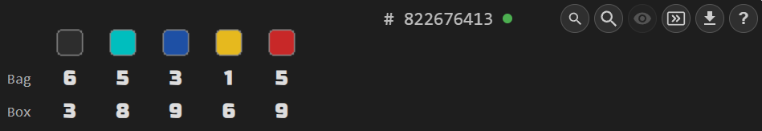
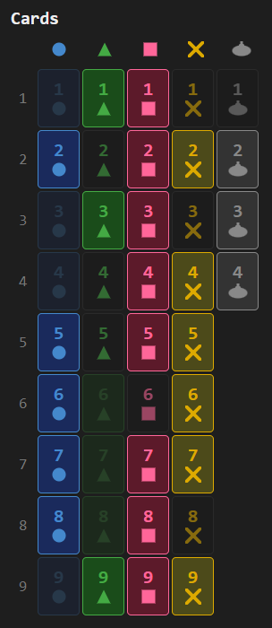
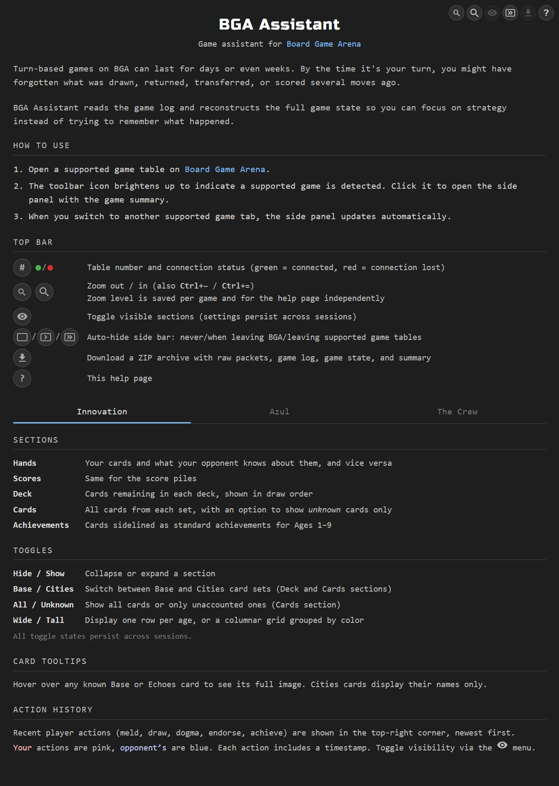

[Home](.) | [Innovation](pages/innovation) | [Azul](pages/azul) | [Crew](pages/crew) | [Development](pages/development) | [Privacy](pages/privacy)

---

*A Chrome extension for [Board Game Arena](https://boardgamearena.com) that keeps track of the game state so you don't have to.*

Turn-based games on BGA can stretch across days or weeks — by the time it's your turn, you may have forgotten what was drawn, returned, transferred, or scored several moves ago. BGA Assistant reads the game log and reconstructs the complete picture for you. The side panel includes a built-in help page — click "?" for a detailed guide on each game's features.

## Install

[Install from Chrome Web Store](#) *(coming soon)*

## Supported Games

Click a game heading for the full feature list and screenshots.

### [Innovation](pages/innovation)

Reads the full game log from Innovation 2-player tables and reconstructs the game state — hand contents and score piles according to revealed cards, and deck stack order with returned cards — displayed as a visual summary in a side panel. Supports the base game and the Echoes of the Past and Cities of Destiny expansions.

### [Azul](pages/azul)

Tracks the tile bag and discard pile (box lid) for Azul tables with any player count. Particularly helpful in 2-player games where the full bag is depleted in exactly 5 rounds. Displays remaining tile counts per color in a compact table so you always know what's left to draw.

### [The Crew: Mission Deep Sea](pages/crew)

Tracks played cards and communication signals to deduce remaining cards in players' hands for The Crew: Mission Deep Sea tables with any player count. The side panel displays three sections — a card grid, a player-suit matrix, and a trick history — all updating live as cards are played.

## Usage

1. Navigate to a supported BGA game page — the toolbar icon brightens up to indicate a supported game is detected
2. Click the BGA Assistant icon in the toolbar to open the side panel with a visual summary of the game state
3. While viewing a game, the side panel automatically updates when the game progresses
4. Switching to another supported game tab automatically updates the display
5. Click the "?" icon for a built-in help page with a detailed guide on each game's sections, toggles, and controls

## Acknowledgments

Card icons and images are from [bga-innovation](https://github.com/micahstairs/bga-innovation), Micah Stairs' BGA implementation of [Innovation](https://boardgamegeek.com/boardgame/63888/innovation) (Carl Chudyk, Asmadi Games). Tile sprites are from BGA's implementation of [Azul](https://boardgamegeek.com/boardgame/230802/azul) (Michael Kiesling, Plan B Games).
