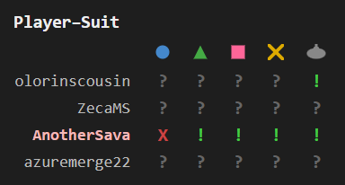
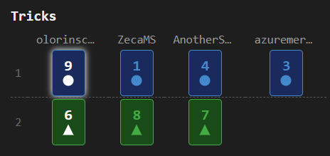

[Home](..) | [Innovation](innovation) | [Azul](azul) | [Crew](crew) | [Development](development)

---

Tracks played cards and communication signals to deduce remaining cards in players' hands for [The Crew: Mission Deep Sea](https://boardgamegeek.com/boardgame/324856/the-crew-mission-deep-sea) tables with any player count. The side panel displays three sections — a card grid, a player-suit matrix, and a trick history — all updating live as cards are played.

### Card grid

Shows all 40 cards (9 cards of each of the 4 coloured suits and 4 submarine trumps) with visual states: dimmed for played cards, neutral for cards in your hand, and bright for cards still in opponents' hands:

### Player-suit matrix

Shows what information we know about players having different suits: "X" (the player has no cards of that suit), "!" (confirmed holding), or "?" (unknown) per player per suit. Suit absence is detected automatically from trick-following behavior, and communication data narrows down holdings further:

### Trick history

Chronological table of all tricks with lead and winner highlights. The current in-progress trick appears below a dashed separator:

### Game features

- **Card grid**: summary of the cards information, both played and in players' hands
- **Suit absence detection**: automatically detects when a player has no cards of a suit from trick-following behavior
- **Communication tracking**: integrates sonar communication data to narrow down card locations
- **Player-suit matrix**: shows "X" (no cards of that suit), "!" (confirmed cards), or "?" (unknown) per player per suit
- **Trick history**: chronological table of all tricks with lead and winner highlights
- **Per-mission state**: automatically resets tracking on each new mission

### Standard features

- **Live tracking**: while the side panel is open, the display automatically updates when the game progresses — a green status dot appears in the status bar
- **Auto-update**: while the side panel is open, switching to another supported game tab automatically extracts and displays its state
- **Status bar**: shows the table number and live tracking indicator
- **Auto-hide**: three-mode toggle controlling side panel behavior — Never (always open), Leaving BGA (closes on non-BGA tabs), Leaving tables (closes when navigating away from supported game tables)
- **Keyboard shortcut**: configurable via `chrome://extensions/shortcuts` to toggle the side panel open/closed
- **Lit icon**: the toolbar icon glows when the active tab has a supported game table open
- **Per-game zoom**: side panel zoom level is saved independently for each game and the help page
- **Persistent settings**: all toggle states, section visibility, and pin mode are saved across sessions
- **Download**: bundled zip with raw data, game log, game state, and standalone summary — attach this archive with a short description if you notice a bug, and I'll prioritize fixing it!
