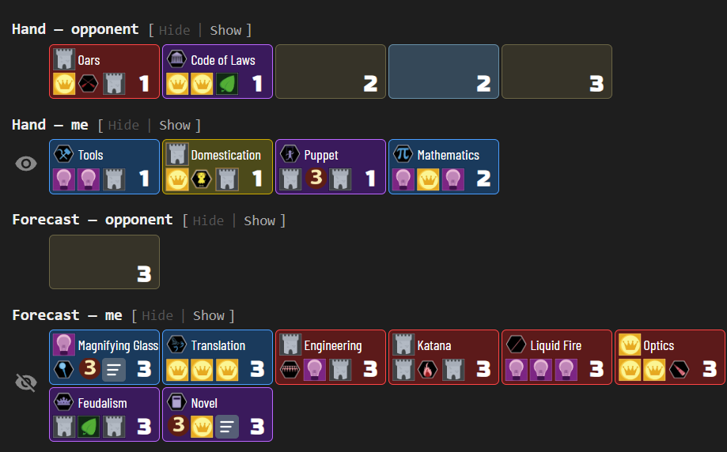
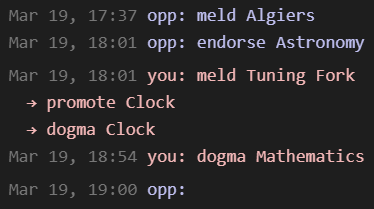
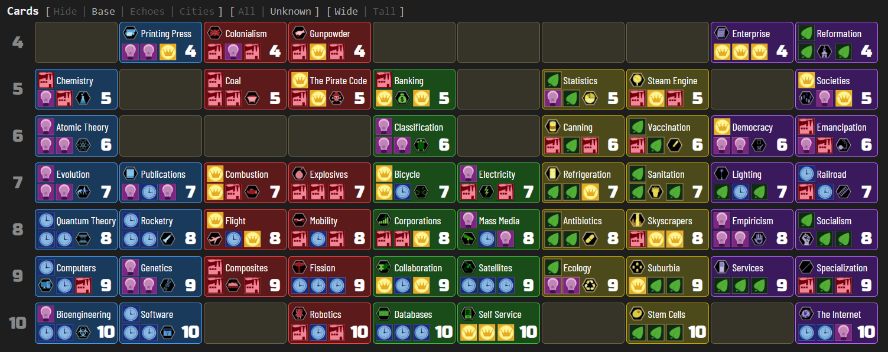
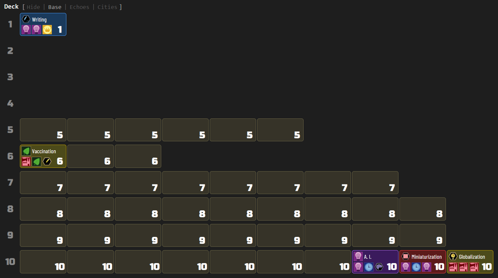

[Home](..) | [Innovation](innovation) | [Azul](azul) | [Crew](crew) | [Development](development) | [Privacy](privacy)

---

Reads the full game log from [Innovation](https://boardgamegeek.com/boardgame/63888/innovation) 2-player tables and reconstructs the game state — hand contents and score piles according to revealed cards, and deck stack order with returned cards — displayed as a visual summary in a side panel. Supports the base game and the Echoes of the Past and Cities of Destiny expansions.

### Hands, forecast and score

Each of those sections shows known cards with their name, icons, and age, while unknown cards appear as placeholders with just the age number and set. An eye icon represents opponent's knowledge:

### Turn history

A compact sidebar shows recent actions — meld, draw, dogma, endorse, achieve, promote — with timestamps and player attribution. Compound actions (e.g. meld → promote → dogma) render as indented sub-action lines:

### Card list

The card list lays out all cards in the game across ages, showing which cards have been identified and which remain unknown. Toggle between Base, Echoes, and Cities sets, filter to show only unaccounted cards, and switch between wide and tall layouts:

### Deck

The deck section shows remaining cards per age, with known cards revealed by name and unknown cards as placeholders:

### Game features

- **Card grids**: hands, scores, deck, full card list, achievements
- **Set toggle**: switch between Base, Echoes, and Cities card sets for deck and card list
- **Filter toggle**: All / Unknown (show only unaccounted cards)
- **Layout toggle**: Wide (one row per age) / Tall (color columns)
- **Turn history**: compact chronological display of recent actions (meld, draw, dogma, endorse, achieve, promote) with card name tooltips; compound actions (e.g. meld → promote → dogma) render as indented sub-action lines
- **Section selector**: eye button to show/hide entire sections (including turn history visibility)
- **Hover tooltips**: card face images with full card details on hover

### Standard features

- **Live tracking**: while the side panel is open, the display automatically updates when the game progresses — a green status dot appears in the status bar
- **Auto-update**: while the side panel is open, switching to another supported game tab automatically extracts and displays its state
- **Status bar**: shows the table number and live tracking indicator
- **Auto-hide**: three-mode toggle controlling side panel behavior — Never (always open), Leaving BGA (closes on non-BGA tabs), Leaving tables (closes when navigating away from supported game tables)
- **Keyboard shortcut**: configurable via `chrome://extensions/shortcuts` to toggle the side panel open/closed
- **Lit icon**: the toolbar icon glows when the active tab has a supported game table open
- **Per-game zoom**: side panel zoom level is saved independently for each game and the help page
- **Persistent settings**: all toggle states, section visibility, and pin mode are saved across sessions
- **Download**: bundled zip with raw data, game log, game state, and standalone summary — attach this archive with a short description if you notice a bug, and I'll prioritize fixing it!
